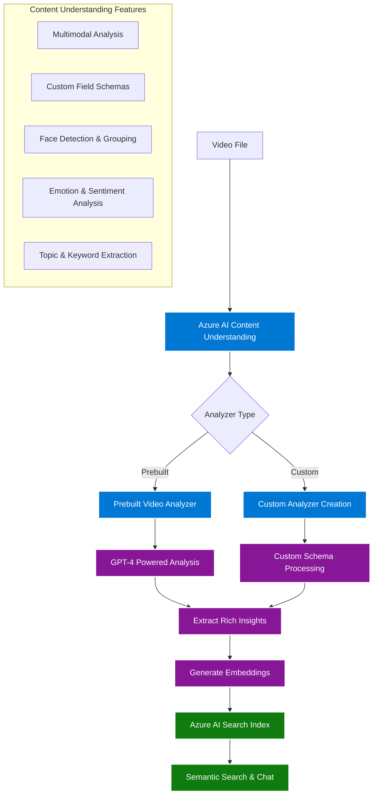

# Azure AI Content Understanding Setup Guide

This guide provides comprehensive instructions for setting up Azure AI Content Understanding service with complete workflow covering prebuilt analyzers, custom analyzer creation, video analysis, and Azure AI Search integration.

## 🎯 Complete Workflow Overview



## 📋 Prerequisites

### Required Azure Services

1. **Azure AI Services** - For Content Understanding capabilities
2. **Azure AI Search Service** - For indexing and searching insights
3. **Azure OpenAI Service** - For embeddings and enhanced processing
4. **Azure Active Directory** - For authentication and authorization

### Required Permissions

- Content Understanding API access
- Azure AI Search contributor access
- Azure OpenAI API access
- Azure Storage access (if using blob storage)

## 🚀 Step 1: Azure AI Content Understanding Service Setup

### 1.1 Create Azure AI Services Resource

1. **Navigate to Azure Portal**
   - Go to [Azure Portal](https://portal.azure.com)
   - Click "Create a resource" → "AI + Machine Learning" → "Azure AI services"

2. **Configure Basic Settings**
   ```
   Subscription: Your subscription
   Resource Group: Create new or use existing
   Region: Supported region (East US, West Europe, etc.)
   Name: content-understanding-service
   Pricing Tier: S0 (Standard)
   ```

3. **Enable Content Understanding**
   - After creation, navigate to your AI Services resource
   - Go to "Resource Management" → "Features"
   - Enable "Content Understanding (Preview)"

### 1.2 Get Service Credentials

```bash
# Get the endpoint and keys
az cognitiveservices account show --name content-understanding-service --resource-group myResourceGroup
az cognitiveservices account keys list --name content-understanding-service --resource-group myResourceGroup
```

Save these values for your `.env` file:
- Endpoint URL
- Primary API Key
