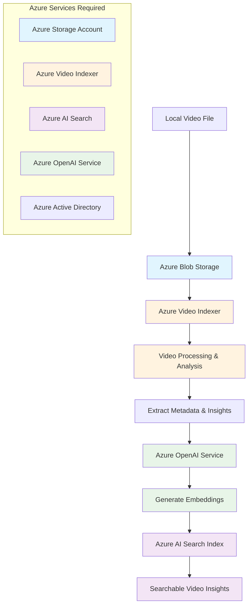

# Azure Video Indexer Setup Guide

This guide provides step-by-step instructions for setting up Azure Video Indexer with the complete workflow: uploading videos to Azure Storage, processing them through Video Indexer, and storing metadata and embeddings in Azure AI Search.

## 🎯 Complete Workflow Overview



## 📋 Prerequisites

### Required Azure Services

1. **Azure Storage Account** - For video file storage
2. **Azure Video Indexer Account** - For video analysis and insights extraction
3. **Azure AI Search Service** - For storing and searching metadata and embeddings
4. **Azure OpenAI Service** - For generating embeddings and enhanced insights
5. **Azure Active Directory App Registration** - For authentication

## 🚀 Step 1: Azure Storage Account Setup

### 1.1 Create Storage Account

1. **Navigate to Azure Portal**
   - Go to [Azure Portal](https://portal.azure.com)
   - Click "Create a resource" → "Storage" → "Storage account"

2. **Configure Basic Settings**
   ```
   Subscription: Your subscription
   Resource Group: Create new or use existing
   Storage Account Name: videostorageaccount[uniqueid]
   Region: Same as your other services
   Performance: Standard
   Redundancy: LRS (for development) or GRS (for production)
   ```

3. **Advanced Settings**
   - Enable "Allow Blob anonymous access" (for development only)
   - Enable "Hierarchical namespace" if using Data Lake

### 1.2 Create Container

1. **Navigate to Containers**
   - Go to your storage account → Data storage → Containers
   - Click "+ Container"

2. **Container Configuration**
   ```
   Name: videos
   Public access level: Private (recommended)
   ```

### 1.3 Get Connection Details

```bash
# Get storage account key
az storage account keys list --resource-group myResourceGroup --account-name mystorageaccount
```

Save these values for your `.env` file:
- Storage Account Name
- Storage Account Key
- Container Name

## 🎬 Step 2: Azure Video Indexer Setup

### 2.1 Create Video Indexer Account

1. **Portal Setup**
   - Go to Azure Portal → Create a resource
   - Search for "Video Indexer" → Create

2. **Configuration**
   ```
   Subscription: Your subscription
   Resource Group: Same as storage account
   Account Name: myvideoindexer[uniqueid]
   Location: Supported region (East US, West Europe, etc.)
   Pricing Tier: S0 (Standard)
   ```

### 2.2 Configure Authentication

1. **Create App Registration**
   ```bash
   # Using Azure CLI
   az ad app create --display-name "VideoIndexerApp" --sign-in-audience AzureADMyOrg
   ```

2. **Get Required IDs**
   - Tenant ID
   - Client ID (Application ID)
   - Client Secret

3. **Assign Permissions**
   - Navigate to App Registration → API permissions
   - Add "Azure Service Management" → user_impersonation

### 2.3 Get Video Indexer Details

```bash
# Get Video Indexer account details
az videoanalyzer account show --name myvideoindexer --resource-group myResourceGroup
```

## 🔍 Step 3: Azure AI Search Setup

### 3.1 Create Search Service

1. **Portal Creation**
   - Azure Portal → Create a resource → Azure AI Search
   
2. **Configuration**
   ```
   Service Name: videosearch[uniqueid]
   Location: Same region as other services
   Pricing Tier: Basic (for development) or Standard (for production)
   ```

